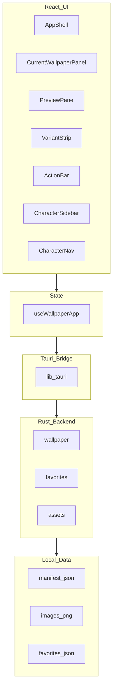

# Touhou Wallpaper — V1 Architecture

Module map for incremental implementation. Read with [AGENTS.md](AGENTS.md) and [PROGRESS.md](PROGRESS.md).

## Goal

Scaffold first (M0): compilable shell, fixed interfaces, stub logic. Fill one module per session (M1–M8).

## System layers



## Directory layout

```text
touhou-wallpaper/
  ARCHITECTURE.md          # this file
  VERIFY.md                # how to self-test each module (plain Chinese)
  src/                     # React UI
  src-tauri/               # Rust commands (requires Rust toolchain)
  scripts/
    download_assets.py
    verify_m0.py ... verify_m8.py
  assets/                  # gitignored images; manifest after M1
  tests/                   # optional tmp_verify during dev
```

## Tauri command contract

| Command | Input | Output | Module |
|---------|-------|--------|--------|
| `get_manifest` | — | Manifest JSON | M2 |
| `get_assets_dir` | — | string path | M2 |
| `resolve_image_path` | filename | absolute path | M2 |
| `get_current_wallpaper` | — | registry path | M3 |
| `set_wallpaper` | filename | void | M3 |
| `list_favorites` | — | string[] | M4 |
| `toggle_favorite` | filename | string[] | M4 |

**Hard rule**: only **应用** (ActionBar) may invoke `set_wallpaper`. Not 换一张, ‹ ›, sidebar, or thumbnails.

## Frontend state (`useWallpaperApp`)

- `manifest`, `activeCharacterId`, `activeVariantIndex`, `favorites`, `currentWallpaperPath`
- Actions: `selectCharacter`, `selectVariant`, `stepCharacter`, `randomCharacter`, `applyWallpaper`, `toggleFavorite`

## Module implementation order

| Module | Scope | Verify script |
|--------|-------|---------------|
| M0 | Full scaffold, layout shell, stubs | `scripts/verify_m0.py` |
| M1 | `download_assets.py` complete | `scripts/verify_m1.py` |
| M2 | Rust paths + manifest commands | `scripts/verify_m2.py` |
| M3 | Wallpaper get/set | `scripts/verify_m3.py` |
| M4 | Favorites persist | `scripts/verify_m4.py` |
| M5 | CharacterSidebar + ‹ › nav (wheel scroll only) | `scripts/verify_m5.py` |
| M6 | Preview + variant strip | `scripts/verify_m6.py` |
| M7 | ActionBar (apply / favorite / random) | `scripts/verify_m7.py` |
| M8 | Theme polish + full PRD pass | `scripts/verify_m8.py` |

## Harness loop (Agent)

1. Read PROGRESS.md → pick one module
2. Implement module only
3. Run `npm run check` (and `npm run verify:mN` when module has script)
4. Fix until **Assertion Passed**
5. Update PROGRESS.md module row + PRD mapping
6. `/handoff` if switching chats

See [VERIFY.md](VERIFY.md) for what each script checks and what you can observe without coding.

## UI layout

```text
+------------------+--------------------------------+
| Character list   | Current wallpaper (small)      |
| (scroll, 001→)   +--------------------------------+
|                  | Large preview + [应用] [收藏]   |
|                  | Variant thumbnails               |
|                  | ‹  001 博丽灵梦  ›              |
+------------------+--------------------------------+
```

## Environment note

- **Rust** required for `npm run tauri dev` (install: https://rustup.rs)
- Until Rust installed: use `npm run dev` (Vite + mock backend in `src/lib/mockBackend.ts`)
