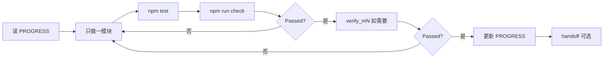

# 自测说明 — 给不懂编程的你

## 一句话

每个模块做完，Agent 会跑**自动检查脚本**（像自动答题卡）。你只看终端里有没有 **Assertion Passed**；有就是通过，没有就继续改。

## 四层检查（由易到难）

| 层 | 是什么 | 你怎么懂 |
|----|--------|----------|
| **1. 语法检查** (`tsc`) | 代码有没有写错、类型对不对 | 不用懂；Agent 跑，失败会自己改 |
| **2. 单元测试** (`vitest` / `npm test`) | 小规则对不对（例如搜索过滤、列表跳转） | Agent **写功能时一起写**；终端全绿才算过 |
| **3. 模块脚本** (`verify_mN.py`) | 这个模块该出现的文件、配置、接线是否齐全 | 终端打印中文说明 + Passed/Failed |
| **4. 你亲手点一点** (部分功能) | 打开应用看界面手感 | 本文「你应该看到什么」 |

本地做完通常要：`npm test` 绿，且 `npm run check` 出现 **Assertion Passed**。  
PR 上的自动审查会再跑 `tsc` + `vitest`（详见根目录 `AGENTS.md`）。

### 测试谁来写（已固定）

| 谁 | 做什么 |
|----|--------|
| **写功能的 Agent** | 在**同一个功能分支**里写好 Vitest（和需要的 verify 脚本）；跑到通过。这是交付物，不是可选项 |
| **GitHub 自动审查 Agent** | 只**跑**测试并写英文评论，不替你补功能测试 |
| **你（Patrick）** | 只按清单**点几下界面**；不用写代码测试 |

短规则入口：根目录 [AGENTS.md](../../AGENTS.md)。

## 你怎么参与

1. 模块做完后，看 Agent 消息里有没有 `Assertion Passed`，以及 `npm test` 是否通过
2. 若 Agent 让你运行命令，复制运行也行（例如 `npm run dev`）
3. 需要手感验收时：打开应用，按 Agent 给的对照清单点几下

## 各模块：自动检查什么 + 你能看到什么

### M0 骨架（当前）

- **自动**：关键文件夹和文件都在；`package.json` 有 `check` 命令；TypeScript 编译通过
- **你可选手动**：`npm run dev` → 浏览器出现蓝白界面，左侧角色列表 + 右侧预览区

### M1 下载立绘

- **自动**：运行下载脚本后，`assets/manifest.json` 里角色数 ≥126、图片数 ≥591
- **你无需操作**（要等几分钟进度条）

### M2 读 manifest

- **自动**：Rust/桥接能返回 manifest（或 mock 切换为真实读文件）
- **手动**：`npm run dev`，左侧列表出现真实角色名（如 `001 博丽灵梦`）

### M3 设壁纸

- **自动**：脚本用命令设一张图，再读 Windows 注册表，路径一致
- **手动**：点【应用】→ 桌面壁纸真的变了

### M4 收藏

- **自动**：收藏后磁盘上有 `favorites.json`；关掉再开还在
- **手动**：点【收藏】→ 再开应用仍显示已收藏

### M5 布局 A（左侧列表 + ‹ ›）

- **自动**：代码里有左右分栏、侧边列表、‹ › 换角色；滚轮不绑在换角色上
- **手动**：
  1. 滚轮在左侧列表上 → 只上下滚动列表，整页和右侧预览不动
  2. 点【换一张】或 ‹ › → 右侧预览换角色，**左侧列表滚动位置不变**
  3. 左侧滚到很下面时 → 右侧大图仍完整可见（占满中间区域）
  4. 点列表某行 → 选中高亮更新，列表不自动乱跳

### M6 预览 + 缩略图

- **自动**：`npm run verify:m6` — 大图区、变体条、点缩略图只改变体索引
- **手动**：点多张立绘的角色（如 001）→ 只换大图，角色不变，桌面不变

### M7 三个按钮

- **自动**：`npm run verify:m7` — 只有【应用】调用设壁纸；【换一张】只换角色预览
- **手动**：【换一张】后桌面不变；【应用】后桌面才变

### M8 收官

- **自动**：`npm run verify:m8` — 跑通 M0–M7 + 文档 + manifest
- **手动**：按 PRD 表逐项点一遍；可选 `npm run tauri dev` 验桌面窗口

### M9 发布分享（方案 A）

- **自动**：`npm run verify:m9` — 图标、下载命令、首次下载 UI、安装包命名脚本
- **打包**：`npm run tauri:build` → `dist/release/东方壁纸_Setup.exe`
- **手动验收**（给朋友的标准流程）：
  1. 双击安装包完成安装（无需额外配置）
  2. 打开应用 → 点「开始下载」
  3. 等进度 100% → 自动进入主界面
  4. 选角色、点应用、桌面壁纸改变

详见 [SHARE.md](../guide/SHARE.md)

## 常用命令（复制给 Agent 或自己跑）

```bash
npm run check          # 每模块做完必跑
npm run verify:m0      # 只查 M0
npm run dev            # 浏览器里看界面（会自动释放 1420 端口）
npm run dev:stop       # 只关掉占用 1420 的旧服务
npm run tauri dev      # 装好 Rust 后的桌面窗口版
```

## 常见报错（不懂代码也能懂）

| 终端里写什么 | 什么意思 | 怎么办 |
|--------------|----------|--------|
| `Port 1420 is already in use` | 上一次的预览服务没关干净，1420 这个「门牌号」还被占着 | 运行 `npm run dev:stop`，再 `npm run dev`；现在 `npm run dev` 会自动先清端口 |
| `link.exe not found` | 电脑还没装好 C++ 编译工具，做不出桌面版程序 | 装好 C++ Build Tools；浏览器版 `npm run dev` 仍可用 |
| 点【应用】桌面不变 | 多半是没重启 dev，或还在用很旧的页面 | 终端 `Ctrl+C` 停掉，再 `npm run dev`，刷新浏览器后重试 |
| 缩略图/壁纸人物被裁切 | 方框用了「填满裁剪」或 Windows 壁纸是「填充」模式 | 已改为完整显示（`contain` + 适应屏幕）；重新点【应用】一次 |

**为什么立绘会被裁切？** 立绘是竖长图，放进小方块时若选「填满」，会像拍照时放大到裁掉脑袋或脚。应用里已改成「完整缩进显示」；设桌面壁纸时会自动改成 Windows 的「适应」模式，让人物全身可见（两侧可能有留白，属正常）。

**文档分工**：`AGENTS.md` 只当**地图**（指向去哪看）；具体报错说明放本文件，避免地图越写越长。

## 和 Agent 循环怎么接上



你不需要会编程：只要问 Agent「通过了吗？」，看有没有 **Assertion Passed** 和测试全绿即可。
